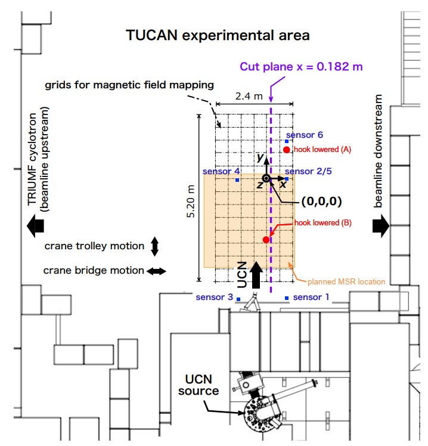
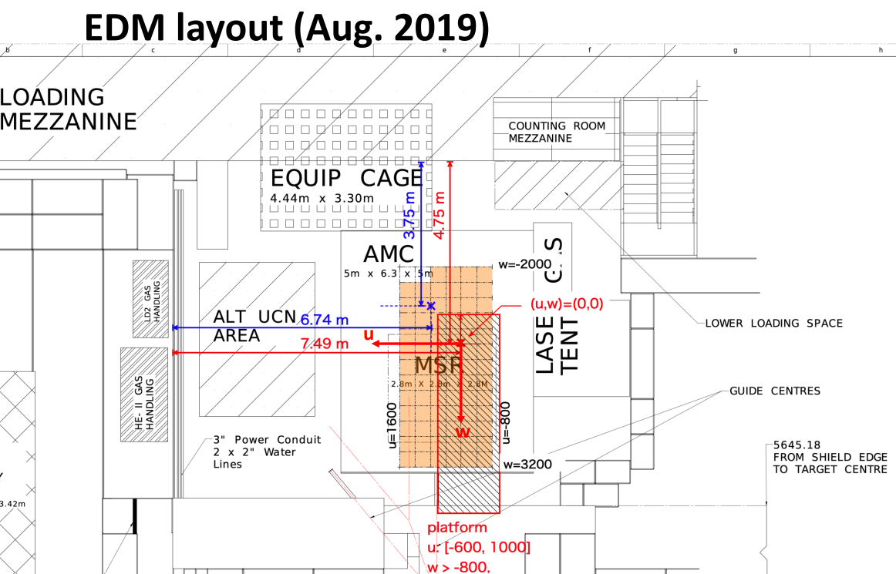
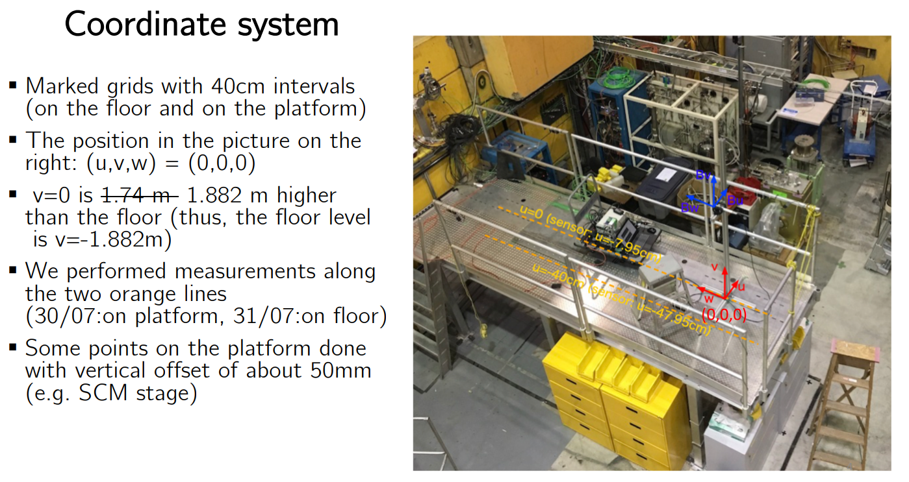
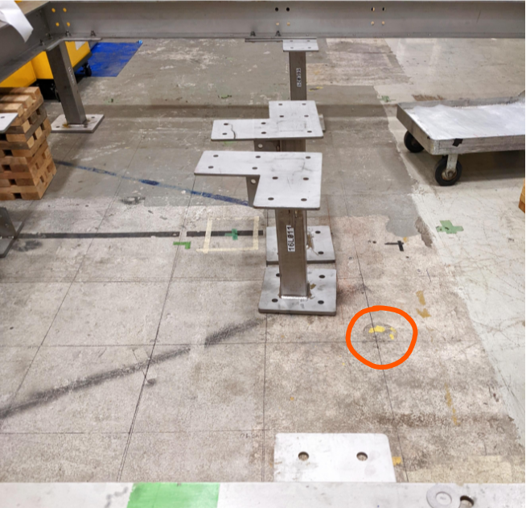
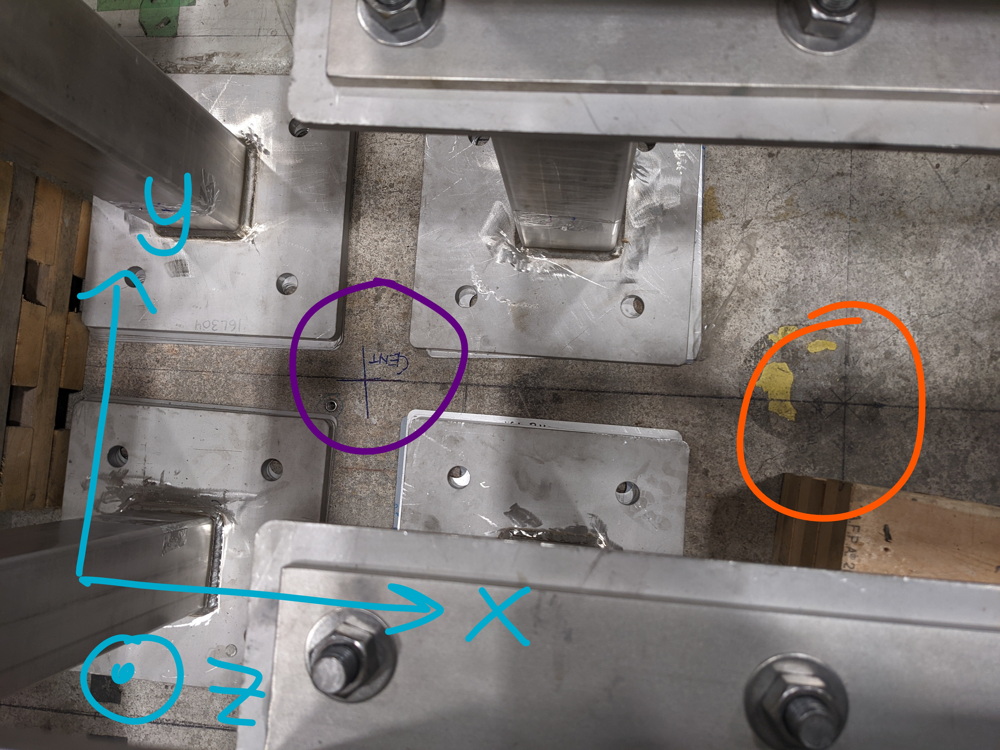
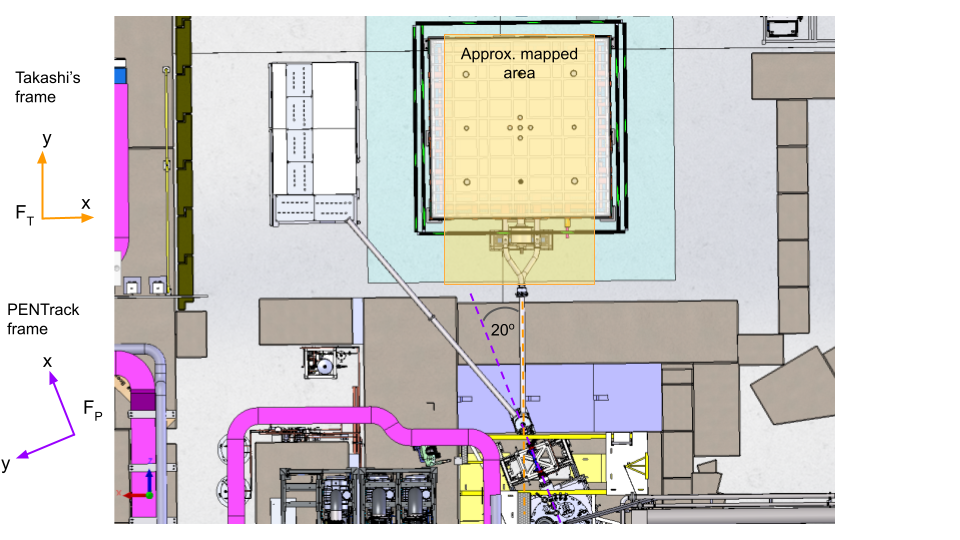

# MagMapping-export_TH
This code is based on Takashi Higuchi's work done on data taken in summer 2019 mapping the magnetic field in a region near where the MSR was planned to be at the time. The orginal code can be found [here](https://github.com/takashihiguchi/tucan-magnetics-mapping-export_20200129).

The orginal measurements were taken on a grid in 40 cm intervals for 3 different levels, and code was written to then interpolate this data and shift the coordinates so that z=0 was the planned center of MSL-MSR. We will call this first coordinate frame $F_T$, with a center of $C_T = (0,0,0)$.

I would like to use this data as a starting point for my simulations of the adiabatic paramter in the UCN guiding tubes to use in the design of the guiding fields.

However, to use this data in a [PENTrack simulation](https://github.com/eklem1/Guides_nEDMsensitivity), a different coordinate system is needed, which we will call $F_P$, as well as the data file needs to be in a specified format. This was worked out in [PositionCalibration.ipynb](https://github.com/eklem1/UCN_work/blob/master/MagneticMappingPrevWork/MagMapping-export_TH/PositionCalibration.ipynb). The final code to fully process Takashi's raw data to the text files that can be used in PENTrack is in [data_transform_interp.py](https://github.com/eklem1/UCN_work/blob/master/MagneticMappingPrevWork/MagMapping-export_TH/data_transform_interp.py), which I have updated from Takashi's previous version.

## Summer 2019 Mapping Overview

This data was taken mostly by Takashi with the cyclotron on.
For more info:
* Lots of weekly meeting updates on plone (see Takashi's stuff in the time range, [etc](https://ucn.triumf.ca/meetings-and-workshops/weekly-canadian-group-meetings/magnetic-shielding-meetings/2019/aug-1-2019/Mapping_magnetic_20190801.pdf/view ))
	
* 12.4.2 Recent magnetic field measurements in Meson Hall in the 2020 CDR, and a bit in the 2022 EAC review
<p align="middle">
  

<br />
  


</p>


### Orginal data files:  Mapping_0809_RUN*.csv
* Needs to be corrected for $C_T = (0,0,0)$, but the axes are aligned as in $F_T$, aligned with the post Y beamline
* x,y,z are in cm
* B_i is in 1 G = 0.1 mT $= 10^{-4}$ T
* also contain the measured gradients of $\vec{B}$

To correct for some things, Takashi's 2019 mapping and processed already used the corrections:
```
df_all['x'] = - df_all.u + 10.25
df_all['y'] = -df_all.w
df_all['z'] = df_all.v -1.25 +188.1 -275 #-> sets z = 0 to the center of the MSR 
# -1.25cm accounts for the position of the sensing center of the probe and the marker on the probe. 
# + 188.1cm: from z=0 of the measurement to the floor, -275cm: from the floor to the planned center of MSR

df_all['B_x'] = -df_all['B_u']
df_all['B_y'] = -df_all['B_w']
df_all['B_z'] = -df_all['B_v'] 
```

## Transformation Work

The original coordinate center ($C_T$) is still marked on the floor of the Meson hall, seen below here circled in orange. I measured the distance from this point to the planned center of the MSR that Tony Hessels marked for me while the MSR base was being built, circled below in purple.

<p align="middle">



</p>

Most of the measurements below are taking using the measurment tools in SOILDWORKS off of the TNS0563 full TUCAN model, except for the 51.7 cm which was simply measured with a tape measurer.

For Z: The distance from the center of the MSR (I think - I am using this as the center of the central electrode) to the floor is now 258.7 cm, whereas Takashi was using 275 cm, so a change of -16.3 cm is needed.
* It also seems that the center of the SCM is equal in Z with the center of the MSR

Horizontal plane: x and y are rotated compared to what is in PENTrack. In PENTrack the guides near the SCM are along x, where as for the mapping the path of the guides into the MSR is along y.
I believe this results in a rotation about the z axis of -110 $^\circ = $ -20 $^\circ$ for the Y bend , -90 $^\circ$ to swap x and y. Using [this report, Fig. 3](https://ucn.triumf.ca/ucn-group-publications/student-reports/Sean%20Lan%20Term%20Report%20Winter%202020.pdf/view) as a reference for the angle in the Y bend.

The difference in $C_{T}$ and $C_{MSR}$ is: 
$C_{T} \rightarrow C_{MSR} = (-51.7, 0, -16.3)$ cm


The difference in $C_{MSR}$ and $C_{SCM}$ is:
$C_{MSR} \rightarrow C_{SCM} = (22.3, -648.9, 0)$ cm

So in total the offset needed to move $C_{T}$ to using $C_{SCM}$ as the origin is: $C_{SCM} \rightarrow C_{T} = (29.4, 648.9, 16.3)$ cm
<p align="middle">

</p>

The shifts of the origin is easy, as you just need to add this shift ($C_{SCM} \rightarrow C_{T}$) to the data's coordinates. However to deal with the rotation you need to rotate not only the coordinates of each data point, but also components of the magnetic field correctly. Finally the resulting data that PENTrack will accept also needs rectlinear data. 

This is done by first shifting and rotating the raw data, and then doing the interpolation to get a finer grid already in $F_{P}$. Then finally we set all the $\vec{B}$ values outside the orginal rectacular area to 0 as to not extrapolate data in a region we know nothing about.
